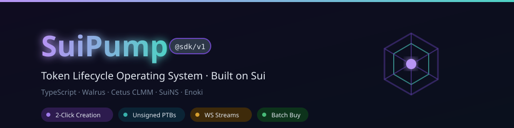
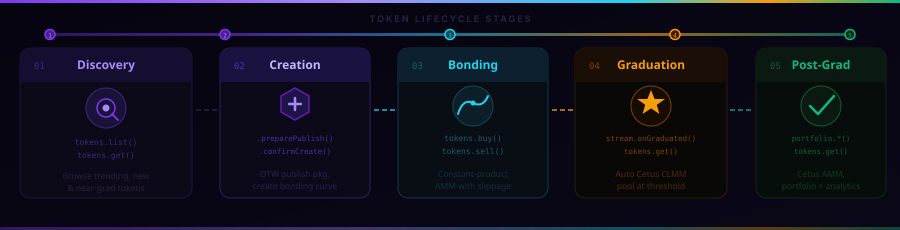

<p align="center">
  
</p>

<br/>

<div align="center">

# ⚡ @suipump/sdk

**TypeScript SDK for the SuiPump Token Lifecycle Operating System**

[](https://www.npmjs.com/package/@suipump/sdk)
[](https://www.typescriptlang.org)
[](https://sui.io)
[](https://github.com/suipump-xyz/suipump-sdk/actions)
[](LICENSE)
[](https://github.com/suipump-xyz/suipump-sdk/releases)

</div>

<br/>

> **🔐 Security-first architecture:** Backend builds unsigned transactions. You sign them with your own wallet. The platform never touches your private keys.

<br/>

SuiPump is the first token lifecycle operating system purpose-built for Sui's object-centric execution model — from creation to bonding curve to Cetus graduation, every stage lives in one native protocol stack.

This SDK gives developers typed, production-grade access to the entire platform.

<details open>
<summary><strong>📊 Platform Comparison</strong></summary>

<br/>
<p align="center">
  
</p>
</details>

<br/>

<details open>
<summary><strong>📈 SDK Metrics</strong></summary>

<br/>
<p align="center">
  
</p>
</details>

---

## 🌟 Why SuiPump

Traditional launchpads stop at token creation. SuiPump extends token lifecycle infrastructure across every stage:

<div style="background:#0A0A0F; border:1px solid #1A1A2A; border-radius:8px; padding:16px; overflow-x:auto;">

| Stage | 🚀 What Happens | 📋 SDK Access |
|-------|-----------------|---------------|
| **🚀 Launch** | 2-click OTW token creation | `tokens.preparePublish()` / `confirmCreate()` |
| **🔍 Discovery** | Trending, new, near-graduation browse | `tokens.list()` / `tokens.get()` |
| **💰 Price Discovery** | Constant-product bonding curve AMM | `tokens.buy()` / `tokens.sell()` |
| **⭐ Reputation** | On-chain creator scoring, early-sell detection | `stream.onReputationUpdate()` |
| **🎓 Graduation** | Auto Cetus CLMM pool at threshold | `stream.onGraduated()` |
| **💧 Liquidity Migration** | LP burn verification, Cetus AMM handoff | `tokens.get()` |
| **🌊 Post-Graduation** | Cetus trading, portfolio analytics | `portfolio.*()` |
| **🤖 Agent Automation** | Batch buy PTB, copy-trade subscriptions | `agent.batchBuy()` / `agent.copySubscribe()` |

</div>

Built specifically for Sui's programmable transaction blocks (PTBs) and object model, SuiPump is not a wrapper around a Web2 API — it is a first-class Sui protocol client.

---

## ✨ Features

<div style="display:grid; grid-template-columns:1fr 1fr; gap:12px;">

<div style="background:#0A0A0F; border:1px solid #1A1A2A; border-radius:8px; padding:12px;">

**🚀 2-Click Token Creation** — OTW-based flow: publish package, create bonding curve. Two transactions, token is live.
</div>

<div style="background:#0A0A0F; border:1px solid #1A1A2A; border-radius:8px; padding:12px;">

**🔐 Unsigned PTB Architecture** — Backend builds transactions, you sign them. The platform never touches your keys.
</div>

<div style="background:#0A0A0F; border:1px solid #1A1A2A; border-radius:8px; padding:12px;">

**🌊 Real-Time WebSocket Streams** — New tokens, trades, graduations, chat messages, King of the Hill updates, reputation changes.
</div>

<div style="background:#0A0A0F; border:1px solid #1A1A2A; border-radius:8px; padding:12px;">

**⚡ Atomic Batch Operations** — Buy up to 10 tokens in a single PTB. Either all succeed or none do.
</div>

<div style="background:#0A0A0F; border:1px solid #1A1A2A; border-radius:8px; padding:12px;">

**🔄 Copy-Trade Automation** — Subscribe to a target trader, receive pre-built scaled PTBs via webhook.
</div>

<div style="background:#0A0A0F; border:1px solid #1A1A2A; border-radius:8px; padding:12px;">

**🌊 Walrus Media Upload** — Upload token images permanently to decentralized storage.
</div>

<div style="background:#0A0A0F; border:1px solid #1A1A2A; border-radius:8px; padding:12px;">

**📊 Portfolio Tracking** — Holdings, trade history, portfolio overview with SuiNS name resolution.
</div>

<div style="background:#0A0A0F; border:1px solid #1A1A2A; border-radius:8px; padding:12px;">

**🔌 Transport-Agnostic** — Works with any `ClientWithCoreApi` (gRPC, GraphQL, JSON-RPC).
</div>

</div>

---

## 🔒 Security Model

<div style="background:#0A0A0F; border:1px solid #1A1A2A; border-radius:8px; padding:16px;">

| Property | Detail |
|----------|--------|
| **🔑 Non-Custodial** | Private keys never leave your wallet |
| **📝 Unsigned PTBs** | Backend returns base64 transaction bytes — your wallet signs |
| **🚫 No Key Storage** | No private keys stored server-side |
| **✍️ Client-Side Signing** | All transactions signed in browser or local environment |
| **🔑 API Key Auth** | Scoped to specific tiers, revokable |

This architecture means SuiPump can never move your funds. Even if the backend is compromised, an attacker cannot forge transactions — they lack your signature.

</div>

---

## 📦 Installation

```bash
npm install @suipump/sdk
```

**📎 Peer dependency** (required):

```bash
npm install @mysten/sui
```

---

## 🚀 Quick Start

```typescript
import { SuiGrpcClient } from '@mysten/sui/grpc'
import { SuiPump } from '@suipump/sdk'

const client = new SuiGrpcClient({
  network: 'mainnet',
  baseUrl: 'https://fullnode.mainnet.sui.io:443',
})

const pump = new SuiPump({
  apiKey: process.env.SUIPUMP_API_KEY,
  client,
  network: 'mainnet',
})

// 📋 List trending tokens
const { tokens } = await pump.tokens.list({ sort: 'volume', limit: 10 })
for (const t of tokens) {
  console.log(`${t.symbol} — ${t.marketCapSui} MCap, ${t.holderCount} holders`)
}

// 🔍 Get token details
const token = await pump.tokens.get('0x...::module::COIN')
console.log(token.name, token.currentPriceMist, token.curveProgress)
```

> 📖 See [`examples/quickstart.ts`](./examples/quickstart.ts) for a runnable version.

---

## 🔄 Token Lifecycle

<p align="center">
  
</p>

Every token on SuiPump passes through five distinct stages. The SDK provides methods for each:

<div style="background:#0A0A0F; border:1px solid #1A1A2A; border-radius:8px; padding:16px;">

| Stage | 🔧 SDK Methods | 📖 Description |
|-------|----------------|----------------|
| **1. 🔍 Discovery** | `tokens.list()`, `tokens.get()` | Browse trending, new, and nearly-graduated tokens |
| **2. 🚀 Creation** | `tokens.preparePublish()`, `tokens.confirmCreate()` | 2-click OTW flow — deploy coin type, create bonding curve |
| **3. 💰 Bonding Curve** | `tokens.buy()`, `tokens.sell()` | Trade against the constant-product bonding curve AMM |
| **4. 🎓 Graduation** | `stream.onGraduated()` | Automatic Cetus CLMM pool creation at threshold |
| **5. 🌊 Post-Graduation** | `tokens.get()`, `portfolio.*()` | Cetus AMM trading, portfolio tracking, analytics |

</div>

---

## 🏗️ Architecture

<p align="center">
  
</p>

### 📐 Domain-Based Isolation

The SDK is one of four independent build domains in the SuiPump monorepo:

```
suipump/
├── contracts/    ← Move smart contracts (13 modules)
├── backend/      ← Node.js API + indexer + PTB builder
├── frontend/     ← Next.js dApp (not needed for SDK usage)
└── sdk/ ← you are here
```

The SDK wraps the Backend REST API and the Sui blockchain interface. It requires no running frontend, no database, and no blockchain node — just an API key.

---

## 📜 Contract Addresses (Testnet)

<div style="background:#0A0A0F; border:1px solid #1A1A2A; border-radius:8px; padding:16px;">

| Contract | Object ID |
|----------|-----------|
| 📦 Package ID | `0x1a6046b029116bb4c8bf1b3f218ced1ffefd50422ef29c1cd4dab9d65ff46f17` |
| 🗂️ Token Registry (Factory) | `0x6974dfeb78c1d9fcf6ef02ac96988dc2c966ecc3e5fcb3ec78a4942218bf9cc6` |
| 🏦 Platform Treasury | `0xb6f454435d60e1914c68f5d7493fd1ca0d7c2dc8b6ec297e360f41103d21b9bb` |
| 🔼 Upgrade Cap | `0x0a9778c506837a8cbfc2c35059a24ccc46746a021a259805903052f5f8569d0a` |
| 👤 Deployer | `0xa02a2b3bfd8de3ca63b5c393eea71b080686f53f434ba8c41db4116ab6e2444d` |
| 🧪 Toolchain | `sui 1.71.1` (edition `2024.beta`) |

</div>

**Network:** `testnet` · **Deployed:** `2026-05-14` · **Move Tests:** `75/75 pass, zero warnings`

> 🔍 View on [Sui Explorer (Testnet)](https://testnet.suiscan.xyz/object/0x1a6046b029116bb4c8bf1b3f218ced1ffefd50422ef29c1cd4dab9d65ff46f17)

Mainnet addresses will be published at launch. External audit is scheduled.

---

## 📊 Current Status

<div style="background:#0A0A0F; border:1px solid #1A1A2A; border-radius:8px; padding:16px;">

| Layer | Status |
|-------|--------|
| 📜 Smart Contracts | ✅ **Deployed on testnet** — 13 modules, 75/75 tests |
| ⚙️ Backend API | ✅ Staging environment |
| 📦 SDK | ✅ Public preview (`v0.1.0-preview`) |
| 🖥️ Frontend | 🔄 Internal testing |

**Deployment:** Package `0x1a6...f17` · Token Registry `0x697...cc6` · Platform Treasury `0xb6f...bb9`

</div>

---

## 📚 API Reference

<details>
<summary><strong>🏗️ SuiPump (Main Class)</strong></summary>

<br/>

```typescript
import { SuiPump } from '@suipump/sdk'
import type { ClientWithCoreApi } from '@mysten/sui/client'

const pump = new SuiPump(options: SuiPumpConfig)
```

**⚙️ `SuiPumpConfig`:**

| Field | Type | Default | Description |
|-------|------|---------|-------------|
| `apiKey` | `string` | — | Your SuiPump API key |
| `client` | `ClientWithCoreApi` | — | Any Sui client (gRPC, GraphQL, JSON-RPC) |
| `network` | `'devnet' \| 'testnet' \| 'mainnet'` | `'mainnet'` | Sui network |
| `apiBaseUrl` | `string` | `https://api.{network}.suipump.xyz/v1` | Custom API endpoint |
| `wsUrl` | `string` | `wss://stream.{network}.suipump.xyz/v1` | Custom WebSocket endpoint |

**🔌 Sub-clients:**

| Property | Type | Description |
|----------|------|-------------|
| `pump.tokens` | `TokensClient` | 🪙 Token metadata, creation, trading |
| `pump.portfolio` | `PortfolioClient` | 📊 Holdings, trades, overview |
| `pump.agent` | `AgentClient` | 🤖 Batch buy, copy-trade subscriptions |
| `pump.stream` | `StreamClient` | 🌊 WebSocket real-time events |
| `pump.media` | `MediaClient` | 🖼️ Walrus media upload |

</details>

<details>
<summary><strong>🪙 TokensClient</strong></summary>

<br/>

#### `tokens.get(coinType: string): Promise<TokenMetadata>`

Get full metadata and current state for a single token.

```typescript
const token = await pump.tokens.get('0xCASTER...::caster::CASTER')
// {
//   coinType: '0xCASTER...::caster::CASTER',
//   name: 'Caster',
//   symbol: 'CASTER',
//   currentPriceMist: '1250000',
//   marketCapSui: '1250000.000000',
//   curveProgress: 42.7,
//   graduated: false,
//   holderCount: 183,
//   totalVolumeSui: '8472300.000000',
//   creatorSuiName: 'caster.sui',
//   walrusBlobId: '...',
//   ...
// }
```

#### `tokens.list(params?: ListTokensParams): Promise<{ tokens: TokenMetadata[]; limit: number; offset: number }>`

List tokens with optional filtering.

```typescript
// 🏆 Top 20 by volume
const { tokens, limit, offset } = await pump.tokens.list({
  sort: 'volume', limit: 20
})

// ✅ Graduated tokens
const graduated = await pump.tokens.list({ graduated: true, sort: 'market_cap' })
```

#### `tokens.getCreationInfo(): Promise<CreationInfo>`

Get the current creation fee and endpoint info.

```typescript
const info = await pump.tokens.getCreationInfo()
// { creationFeeSui: '0.5', creationFeeMist: '500000000', ... }
```

#### `tokens.preparePublish(params: CreateTokenParams): Promise<PublishResult>`

**Step 1️⃣ of the 2-click OTW flow.** The backend generates a minimal OTW Move package from your token info and returns an unsigned publish transaction.

| Param | Type | Required | Description |
|-------|------|----------|-------------|
| `name` | `string` | ✅ | Token name |
| `symbol` | `string` | ✅ | Token symbol (max 10 chars) |
| `description` | `string` | | Token description |
| `creatorAddress` | `string` | ✅ | Creator's Sui address |
| `imageBlobId` | `string` | | Walrus blob ID (upload via `media.upload()`) |
| `twitter` | `string` | | Twitter handle |
| `telegram` | `string` | | Telegram invite link |
| `website` | `string` | | Website URL |

```typescript
const result = await pump.tokens.preparePublish({
  name: 'My Token',
  symbol: 'MTK',
  description: 'My awesome token',
  creatorAddress: '0x...',
  imageBlobId: 'blob-id-from-media-upload',
})
```

#### `tokens.confirmCreate(params: ConfirmCreateParams): Promise<{ token: TokenMetadata; creationTxHash: string }>`

**Step 2️⃣ of the 2-click OTW flow.** After the user publishes the OTW package, confirm the token creation.

| Param | Type | Required | Description |
|-------|------|----------|-------------|
| `name` | `string` | ✅ | Must match `preparePublish` |
| `symbol` | `string` | ✅ | Must match `preparePublish` |
| `description` | `string` | | |
| `creatorAddress` | `string` | ✅ | |
| `publishedPackageId` | `string` | ✅ | Package ID from publish tx effects |
| `treasuryCapObjectId` | `string` | ✅ | TreasuryCap from publish tx effects |
| `coinMetadataObjectId` | `string` | ✅ | CoinMetadata from publish tx effects |
| `imageBlobId` | `string` | | |

```typescript
const { token, creationTxHash } = await pump.tokens.confirmCreate({
  name: 'My Token',
  symbol: 'MTK',
  creatorAddress: '0x...',
  publishedPackageId: '0x...',
  treasuryCapObjectId: '0x...',
  coinMetadataObjectId: '0x...',
})
```

> 📖 **Full creation flow:** See [`examples/token-creation.ts`](./examples/token-creation.ts)

#### `tokens.buy(params: BuyParams): Promise<PTBResult>`

Build an unsigned buy PTB. Returns base64-encoded transaction bytes that the user signs and submits.

| Param | Type | Default | Description |
|-------|------|---------|-------------|
| `coinType` | `string` | — | Token's full coin type |
| `suiAmountMist` | `string` | — | Amount of SUI to spend (in MIST) |
| `minTokensOut` | `string` | — | Minimum tokens to receive (slippage protection) |
| `buyerAddress` | `string` | — | Buyer's Sui address |
| `slippageBps` | `number` | `50` | Slippage tolerance in basis points (50 = 0.5%) |

```typescript
const ptb = await pump.tokens.buy({
  coinType: '0x...::my_token::MY_TOKEN',
  suiAmountMist: '1000000000', // 1 SUI
  minTokensOut: '990000000',   // 1% slippage
  buyerAddress: '0x...',
  slippageBps: 100,
})
// {
//   ptbBytes: 'AAAC...',        // ← base64 Transaction bytes
//   estimatedGasSui: '0.001',   // estimated gas cost
//   expectedOut: '995000000',   // expected token output
//   priceImpactPct: 0.85,       // price impact percentage
// }
```

#### `tokens.sell(params: SellParams): Promise<PTBResult>`

Build an unsigned sell PTB.

| Param | Type | Default | Description |
|-------|------|---------|-------------|
| `coinType` | `string` | — | Token's full coin type |
| `tokenAmount` | `string` | — | Amount of tokens to sell |
| `minSuiOutMist` | `string` | — | Minimum SUI to receive |
| `sellerAddress` | `string` | — | Seller's Sui address |
| `slippageBps` | `number` | `50` | Slippage tolerance in basis points |

```typescript
const ptb = await pump.tokens.sell({
  coinType: '0x...::my_token::MY_TOKEN',
  tokenAmount: '1000000',
  minSuiOutMist: '990000000',
  sellerAddress: '0x...',
  slippageBps: 100,
})
```

</details>

<details>
<summary><strong>📊 PortfolioClient</strong></summary>

<br/>

#### `portfolio.getHoldings(address: string): Promise<{ address: SuiAddress; holdings: PortfolioHolding[] }>`

Get all token holdings for an address.

```typescript
const { address, holdings } = await pump.portfolio.getHoldings('0x...')
// Each holding: { token: TokenMetadata, balance: string, valueSui: string }
```

#### `portfolio.getTrades(address: string, params?: { limit?: number }): Promise<{ address: SuiAddress; trades: TradeRecord[]; limit: number }>`

Get trade history for an address.

```typescript
const { trades } = await pump.portfolio.getTrades('0x...', { limit: 50 })
// Each trade: { txHash, coinType, tradeType, suiAmount, tokenAmount, priceMist, timestamp }
```

#### `portfolio.getOverview(address: string): Promise<PortfolioOverview>`

Get a portfolio summary with balances and activity counts.

```typescript
const overview = await pump.portfolio.getOverview('0x...')
// { address, suiBalance, portfolioValueSui, holdingsCount, tradesTodayCount, totalTrades }
```

</details>

<details>
<summary><strong>🤖 AgentClient</strong></summary>

<br/>

#### `agent.batchBuy(params: BatchBuyParams): Promise<PTBResult>`

Build a single PTB that buys up to 10 tokens atomically. Requires **Agent tier** API key.

| Param | Type | Description |
|-------|------|-------------|
| `buys` | `Array<{ coinType, suiAmountMist, minTokensOut, slippageBps? }>` | Token buy specs |
| `buyerAddress` | `string` | Buyer's Sui address |

```typescript
const ptb = await pump.agent.batchBuy({
  buys: [
    { coinType: '0x...::a::A', suiAmountMist: '1000000000', minTokensOut: '990000000' },
    { coinType: '0x...::b::B', suiAmountMist: '500000000', minTokensOut: '495000000' },
    { coinType: '0x...::c::C', suiAmountMist: '250000000', minTokensOut: '247500000' },
  ],
  buyerAddress: '0x...',
})
```

#### `agent.copySubscribe(params: CopySubscribeParams): Promise<CopySubscription>`

Subscribe to a target trader. Every time they trade, the platform sends a webhook with a pre-built scaled PTB.

| Param | Type | Default | Description |
|-------|------|---------|-------------|
| `targetTrader` | `string` | — | Target wallet address to follow |
| `subscriber` | `string` | — | Your wallet address |
| `maxSuiPerTrade` | `string` | `'1000000000'` | Max SUI per copy trade (MIST) |
| `ratio` | `number` | `100` | Percentage of target's trade size |

```typescript
const sub = await pump.agent.copySubscribe({
  targetTrader: '0x_SMART_TRADER',
  subscriber: '0x_MY_WALLET',
  maxSuiPerTrade: '2000000000',  // 2 SUI max per trade
  ratio: 50,                      // Copy 50% of target's size
})
// { subscriptionId, targetTrader, subscriber, maxSuiPerTrade, ratio, status, message }
```

#### `agent.unsubscribe(subscriptionId: string): Promise<UnsubscribeResult>`

Cancel a copy-trade subscription.

```typescript
await pump.agent.unsubscribe('sub-id-here')
```

</details>

<details>
<summary><strong>🌊 StreamClient (WebSocket)</strong></summary>

<br/>

The stream client provides real-time event subscriptions with automatic reconnection.

```typescript
const stream = pump.stream
  .onNewToken((event) => {
    // { event: 'new_token', data: TokenMetadata, ts: number }
    console.log('🆕 New token:', event.data.name)
  })
  .onTrade((event) => {
    // { event: 'trade', data: TradeEvent, ts: number }
    console.log('💱 Trade:', event.data.tradeType, event.data.suiAmount)
  })
  .onGraduated((event) => {
    // { event: 'graduated', data: { coinType: string }, ts: number }
    console.log('🎓 Graduation!', event.data.coinType)
  })
  .onChatMessage((event) => {
    // { event: 'chat_message', data: ChatMessage, ts: number }
  })
  .onKothUpdate((event) => {
    // { event: 'koth_update', data: KothData, ts: number }
    console.log('👑 New KOTH:', event.data.name)
  })
  .onReputationUpdate((event) => {
    // { event: 'reputation_update', data: ReputationData, ts: number }
  })
  .connect() // 🔌 Start the WebSocket connection

// Remove handlers
stream.offNewToken(handler)
stream.offTrade(handler)

// Manual connect/disconnect
stream.connect()
stream.disconnect()

// Check connection
if (stream.isConnected()) {
  console.log('✅ WebSocket connected')
}
```

> 📖 **Full streaming example:** [`examples/stream-trading.ts`](./examples/stream-trading.ts)

</details>

<details>
<summary><strong>🖼️ MediaClient (Walrus)</strong></summary>

<br/>

#### `media.upload(data: string, contentType: string): Promise<{ blobId: string }>`

Upload base64-encoded data to Walrus decentralized storage.

```typescript
const { blobId } = await pump.media.upload(
  'iVBORw0KGgo...',  // base64-encoded image
  'image/png'
)
```

#### `media.getUrl(blobId: string, network?: 'mainnet' | 'testnet'): string`

Get the Walrus aggregator URL for a blob.

```typescript
const url = pump.media.getUrl(blobId)
// https://aggregator.walrus-mainnet.walrus.space/v1/{blobId}
```

</details>

---

## ⚡ Performance

<div style="background:#0A0A0F; border:1px solid #1A1A2A; border-radius:8px; padding:16px;">

| Metric | Result |
|--------|--------|
| 🚀 PTB Build Latency | < 50ms |
| 🌊 Stream Delivery (p95) | < 200ms |
| ⚡ Batch Buy Capacity | 10 tokens atomic |
| 🪙 Token Creation | 2 transactions |
| 📡 Indexing Lag | < 1 second |
| 🧪 Test Suite | 186+ tests |

</div>

---

## 📋 Types

```typescript
import type {
  // 🏷️ Branded types
  SuiAddress,           // string — Sui address
  CoinType,             // string — Full coin type (0xPKG::mod::NAME)
  MistAmount,           // string — Amount in MIST (1 SUI = 1e9 MIST)

  // 📄 Token data
  TokenMetadata,        // Full token info with market data
  TradeRecord,          // Individual trade record

  // 📝 PTB building
  PTBResult,            // { ptbBytes, estimatedGasSui, expectedOut, priceImpactPct }

  // 📊 Portfolio
  PortfolioHolding,     // { token, balance, valueSui }
  PortfolioOverview,    // { address, suiBalance, portfolioValueSui, ... }

  // 🌊 Real-time
  StreamEvent,          // Union type of all WebSocket events
  NewTokenEvent,
  TradeStreamEvent,
  GraduationEvent,
  ChatMessageEvent,
  KothUpdateEvent,
  ReputationUpdateEvent,

  // 💬 Chat & media
  ChatMessage,
  GatedContent,
  KothData,
  ReputationData,
} from '@suipump/sdk'
```

---

## 🌐 Networks

<div style="background:#0A0A0F; border:1px solid #1A1A2A; border-radius:8px; padding:16px;">

| Network | 🔗 gRPC Endpoint | ⚙️ API Base URL | 🌊 WebSocket URL |
|---------|------------------|-----------------|-------------------|
| **mainnet** | `https://fullnode.mainnet.sui.io:443` | `https://api.mainnet.suipump.xyz/v1` | `wss://stream.mainnet.suipump.xyz/v1` |
| **testnet** | `https://fullnode.testnet.sui.io:443` | `https://api.testnet.suipump.xyz/v1` | `wss://stream.testnet.suipump.xyz/v1` |
| **devnet** | `https://fullnode.devnet.sui.io:443` | `https://api.devnet.suipump.xyz/v1` | `wss://stream.devnet.suipump.xyz/v1` |

</div>

---

## 🗺️ Roadmap

| Version | Focus | Status |
|---------|-------|--------|
| **v0.1** 🚀 | SDK Preview — OTW creation, PTB builder, streams, Walrus, portfolio API | ✅ Live |
| **v0.2** 🖥️ | Public Launchpad UI — discovery page, token chart, buy/sell widgets | 🔄 In progress |
| **v0.3** 🤖 | Agent Automation — batch buy, copy-trade, webhook infrastructure | 📅 Planned |
| **v0.4** ⭐ | Reputation Layer — on-chain creator scoring, analytics, leaderboards | 📅 Planned |
| **v1.0** ✅ | Mainnet Production — audited contracts, mainnet deploy, API GA | 📅 Q3 2026 |

---

## 📖 Examples

| File | Description |
|------|-------------|
| [`examples/quickstart.ts`](./examples/quickstart.ts) | 🚀 SDK setup, list tokens, get metadata, portfolio overview |
| [`examples/token-creation.ts`](./examples/token-creation.ts) | 🪙 Complete 2-click OTW token creation flow |
| [`examples/stream-trading.ts`](./examples/stream-trading.ts) | 🌊 WebSocket subscriptions, buy/sell PTB building, batch buy, copy-trade, media upload |

Run any example:

```bash
SUIPUMP_API_KEY=your-key npx tsx examples/quickstart.ts
```

---

## ❌ Error Handling

All methods throw typed errors on failure:

```typescript
try {
  const token = await pump.tokens.get('0x...')
} catch (err) {
  if (err instanceof Error) {
    // API errors include HTTP status: "API error: 404 - Not found"
    // Network errors: "TypeError: fetch failed"
    console.error(err.message)
  }
}
```

---

## 💳 API Tiers

<div style="background:#0A0A0F; border:1px solid #1A1A2A; border-radius:8px; padding:16px;">

| Tier | Rate Limit | Access |
|------|-----------|--------|
| **🆓 Free** | 60 req/min | Read-only endpoints (`GET`), streams |
| **⚡ Pro** | 600 req/min | All endpoints including PTB building |
| **🤖 Agent** | 6,000 req/min | Batch buy, copy-trade, priority stream |

</div>

---

## 🤝 Contributing

```bash
git clone https://github.com/suipump-xyz/suipump-sdk.git
cd sdk
npm install
npm test          # Run test suite (186+ tests)
npm run typecheck # Type-check all files
npm run build     # Build to dist/
```

See [CONTRIBUTING.md](./CONTRIBUTING.md) for branch naming conventions and PR checklist.

### 📂 Project Structure

```
sdk/
├── src/
│   ├── client.ts        ← Main SuiPump class
│   ├── tokens.ts        ← Token creation, trading, metadata
│   ├── portfolio.ts     ← Portfolio holdings and history
│   ├── agent.ts         ← Batch buy, copy-trade
│   ├── stream.ts        ← WebSocket event streaming
│   ├── media.ts         ← Walrus media upload
│   ├── types.ts         ← All TypeScript interfaces
│   ├── validation.ts    ← Input validation utilities
│   └── index.ts         ← Public exports
├── tests/               ← Vitest test suite (186+ tests)
├── examples/            ← Runnable example files
├── docs/                ← Architecture & vision docs
├── assets/              ← SVG diagrams & badges
│   ├── banner.svg       ← Hero banner
│   ├── architecture.svg ← System architecture diagram
│   ├── token-lifecycle.svg ← Token flow visualization
│   ├── comparison.svg   ← Platform comparison chart
│   ├── metrics.svg      ← SDK metrics bar chart
│   ├── sui-badge.svg    ← Sui ecosystem badge
│   └── coverage-badge.svg
├── LICENSE
├── SECURITY.md
├── CONTRIBUTING.md
├── CODE_OF_CONDUCT.md
└── CHANGELOG.md
```

---

## 📄 License

MIT © 2026 SuiPump

<br/>

<p align="center">
  <sub>Built on <a href="https://sui.io">⛓️ Sui</a>.
  Powered by <a href="https://www.walrus.xyz">🌊 Walrus</a>,
  <a href="https://cetus.zone">🦀 Cetus</a>,
  <a href="https://suins.io">🔗 SuiNS</a>, and
  <a href="https://enoki.mystenlabs.com">🔑 Enoki</a>.</sub>
</p>
